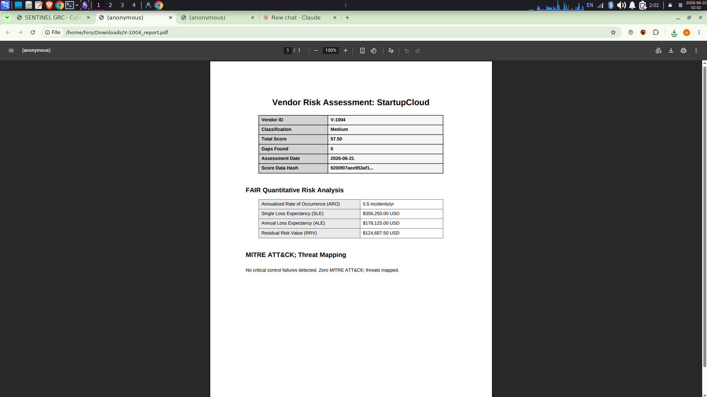

# Case Study: Translating Cyber Risk into Financial Impact using FAIR Methodology

## Executive Summary
The Chief Information Security Officer (CISO) of a large manufacturing firm struggled to secure budget for supply chain security remediations. The Board of Directors did not understand technical metrics like "CVSS scores" or "Missing Access Controls." By deploying SENTINEL, the CISO was able to translate these technical gaps into precise, actuarial financial loss expectations in USD.

## The Challenge
* The GRC team identified severe vulnerabilities across three critical software suppliers.
* When presenting these findings to the Board, the metrics used (e.g., "High Risk Tier", "20 Control Gaps") failed to convey the actual business danger.
* The Board denied the $250,000 budget request needed to implement compensating controls.

## The SENTINEL Solution
The organization activated SENTINEL's native FAIR (Factor Analysis of Information Risk) quantification engine. 

### Actuarial Risk Quantification
SENTINEL automatically ingested the vendor gap data and processed it through the FAIR model. It calculated the Annualized Rate of Occurrence (ARO) and the Single Loss Expectancy (SLE) based on the asset value connected to each vendor.

### Automated Board Reporting
Instead of manually compiling PowerPoint slides, the CISO utilized SENTINEL's PDF/A reporting engine. The generated report clearly displayed the Annualized Loss Expectancy (ALE).

## Business Impact
* **Effective Executive Communication:** The CISO presented a SENTINEL report showing a $3.5 Million Annualized Loss Expectancy directly linked to the vulnerable suppliers.
* **Budget Approval:** Presented with clear financial metrics rather than technical jargon, the Board immediately approved the $250,000 remediation budget.
* **ROI Tracking:** The organization now uses SENTINEL's "What-If" simulator to prove the exact financial Return on Investment (ROI) of every security control they mandate their vendors to implement.
